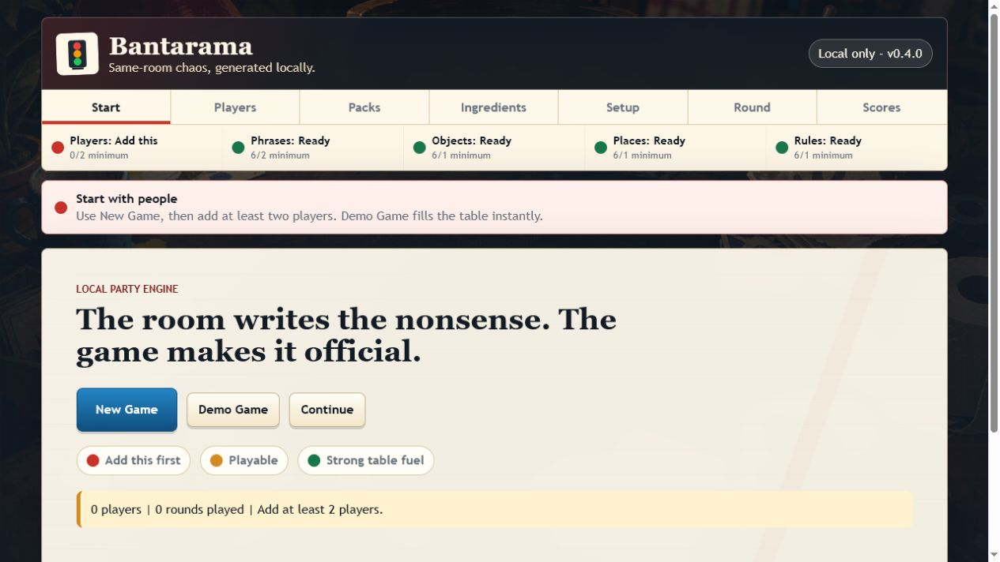
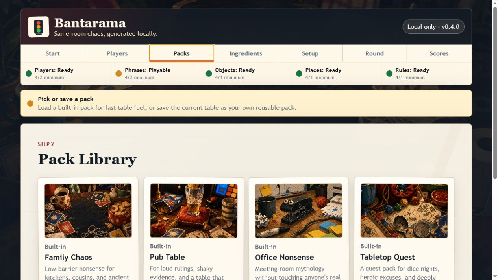
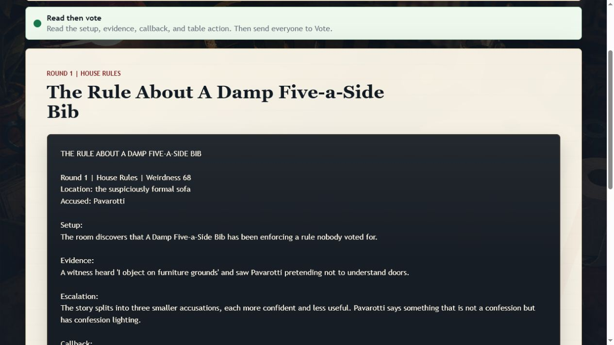
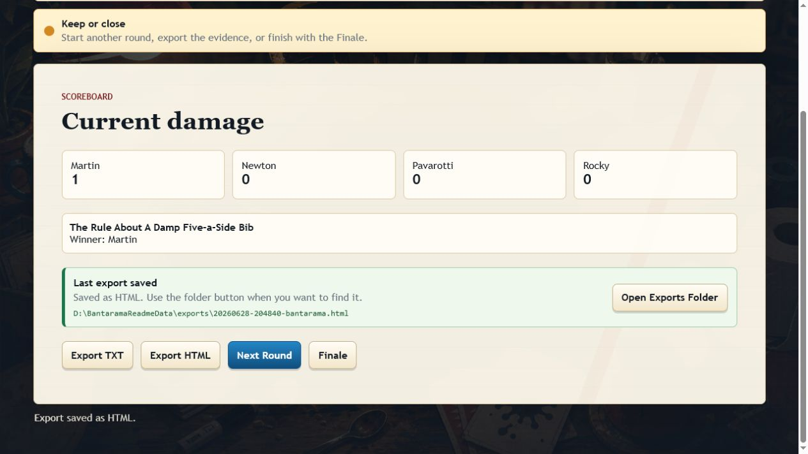

# Bantarama

**A local party game of ridiculous rulings.**

Bantarama turns your group chat energy, family arguments, pub-table evidence,
and strange little in-jokes into playable rounds. Add people, load a pack, press
the big button, then read the generated nonsense out loud and vote who deserves
the point.

No API keys. No accounts. No cloud calls. No npm. No build step.

[Download the latest ZIP](https://github.com/Martin123132/Bantarama/releases/latest)



## Quick Start

For most Windows users:

1. Download the `Bantarama-...zip` file from the latest release.
2. Unzip it somewhere easy to find.
3. Double-click `START_BANTARAMA_WINDOWS.bat`.
4. When the browser opens, press **Demo Game** or add your own players.
5. Follow the traffic lights and start a round.

If you are explaining it over the phone: download, unzip, double-click, press
the big obvious button. That is the whole vibe.

## What You Get

- **Traffic-light guidance**: red means add this first, amber means playable,
  green means strong table fuel.
- **Separate pages** for players, packs, ingredients, setup, rounds, voting, and
  scores, so the host is not staring at one giant control panel.
- **Built-in packs** for Family Chaos, Pub Table, Office Nonsense, and Tabletop
  Quest.
- **Local exports** to TXT or HTML.
- **Saved custom packs** for your own names, phrases, objects, places, and rules.
- **Deterministic local generation**, so the game works without paid AI services.

## Screenshots

| Pick a pack | Read a round |
| --- | --- |
|  |  |

| Vote, score, export | Keep it local |
| --- | --- |
|  | Exports and saved packs stay on your machine. Set `BANTARAMA_HOME` if you want them on `D:\` or another folder. |

## How A Game Flows

1. **Start**: new game, demo game, or continue.
2. **Players**: add at least two names.
3. **Packs**: load a built-in pack or save your own.
4. **Ingredients**: add phrases, objects, places, and rules.
5. **Setup**: choose the round type, round count, and weirdness.
6. **Round**: read the generated ruling out loud.
7. **Vote**: award the point.
8. **Scores**: export the evidence or start the next round.

## If Python Is Missing

Bantarama needs Python 3.10 or newer.

Download it here:

```text
https://www.python.org/downloads/windows/
```

During install, tick:

```text
Add python.exe to PATH
```

Then double-click `START_BANTARAMA_WINDOWS.bat` again.

## Keeping Data On D:

The launcher stores game data in this repo's `data` folder by default. If the
repo is on `D:\`, the game data stays on `D:\` too.

For a D-drive playtest run from PowerShell:

```powershell
cd D:\Projects\Bantarama
New-Item -ItemType Directory -Force -Path D:\Temp, D:\BantaramaData | Out-Null
$env:TEMP = "D:\Temp"
$env:TMP = "D:\Temp"
$env:BANTARAMA_HOME = "D:\BantaramaData"
python -m house_rules_app.app
```

Saved exports and packs then live here:

```text
D:\BantaramaData\exports
D:\BantaramaData\packs
```

## Project Map

- [Tester script](docs/TESTER_SCRIPT.md): send this with the ZIP to someone new.
- [Playtest sheet](docs/PLAYTEST_SHEET.md): track what actually made people laugh.
- [Demo scenes](docs/demo-scenes/README.md): fixed-seed examples for tuning.
- [Development plan](docs/DEVELOPMENT_PLAN.md): where the app can go next.
- [Release checklist](docs/RELEASE_CHECKLIST.md): what to check before shipping.

## Development Checks

```powershell
python -m unittest discover -s tests
python -m compileall house_rules_app tests scripts
python scripts\sample_rounds.py --count 5
python scripts\write_demo_scenes.py
python -m house_rules_app.app --doctor
```

To build the ZIP:

```powershell
powershell -ExecutionPolicy Bypass -File scripts\make_release_zip.ps1
```

The release ZIP is written to `dist\` and excludes `.git`, caches, local data,
exports, logs, and temporary files.

## Licence

Bantarama is source-available for personal and non-commercial use under the
PolyForm Noncommercial License 1.0.0. See [LICENSE](LICENSE).
